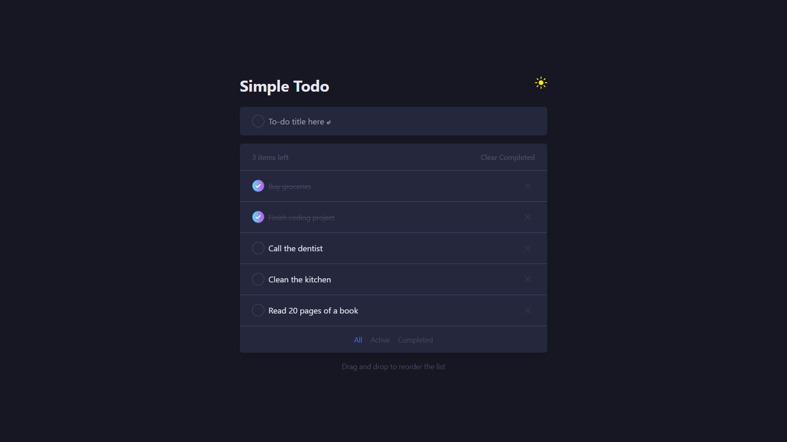
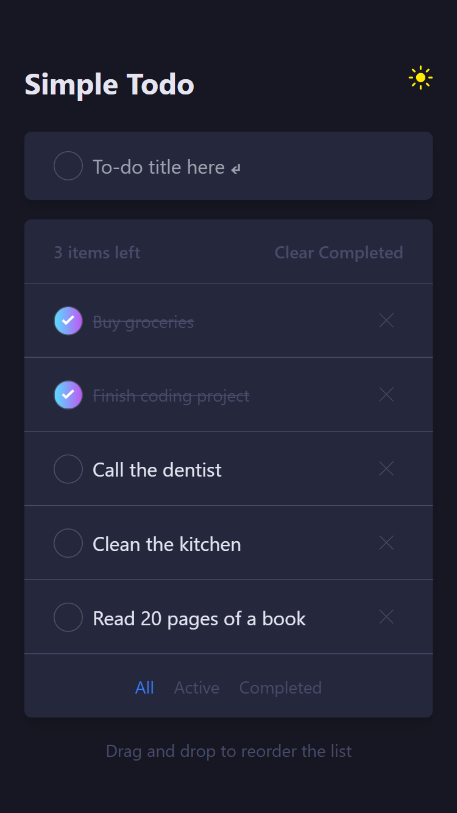
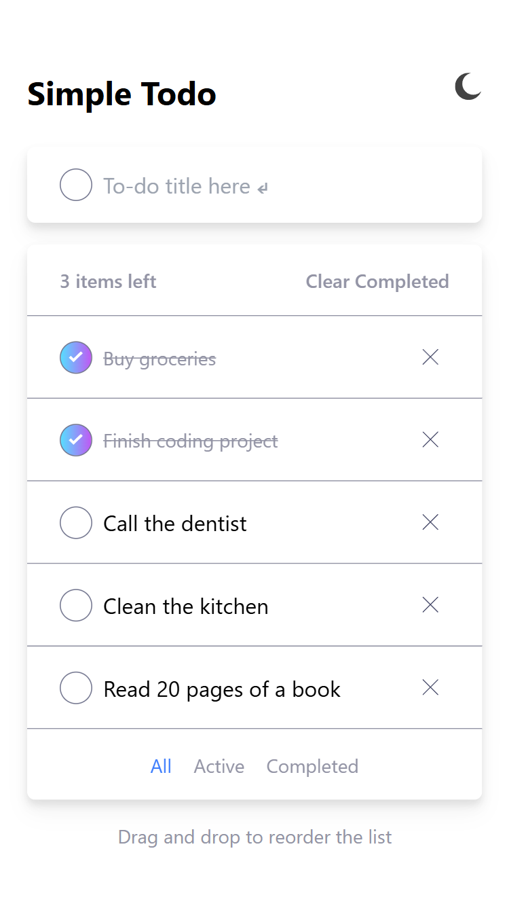

# 📝 To-do App with Reordering

A practice project built to explore **React**, **TypeScript**, drag-and-drop interactions, **SQLite** persistence, and automated testing with **Vitest** and **React Testing Library**.

Create, complete, delete, and reorder tasks with drag and drop. Includes filtering, theme switching (light/dark), and a simple **Node.js + Express.js + SQLite** backend.

---


---

## 🚀 Features

- Create a todo  
- Mark a todo as completed  
- Delete a todo  
- Reorder todos by drag and drop  
- Filter by All, Active, and Completed  
- Clear all completed todos  
- Switch between Light and Dark themes  
- Save todos in a local SQLite database  
- Fully responsive for Desktop and Mobile  

---

## 🧩 Tech Stack

**Frontend:** React + Vite + TypeScript + Tailwind CSS  
**Animations:** Framer Motion  
**Backend:** Node.js + Express.js + SQLite  
**Testing:** Vitest + React Testing Library  

---

## 🛠️ Getting Started

### Prerequisites

- Node.js (v18 or higher)
- npm or yarn

### Installation

1. **Clone this repository:**
    ```bash
   git clone https://github.com/dev-david-alves/todo-app-with-reordering.git
   cd todo-app-with-reordering
    ````

2. **Install dependencies:**

   ```bash
   cd server && npm install
   cd ../client && npm install
   ```

3. **Start the backend:**

   ```bash
   cd server
   npm start
   ```

4. **Start the frontend:**

   ```bash
   cd client
   npm run dev
   ```

5. **Open the local address** (usually):

   ```
   http://localhost:5173
   ```

---

## 🧪 Running Tests

Run unit and integration tests using Vitest and React Testing Library:

```bash
npm run test
```
or
```bash
npm run test:ui
```

---

## 🖼️ Screenshots

### 💻 Desktop Dark Mode



### 💻 Desktop Light Mode


### 📱 Mobile Dark Mode



### 📱 Mobile Light Mode



### 🧪 Test Results


---

## 👤 Author

**David Alves** </br>
Bachelor in Computer Science at the Federal University of Ceará </br>
💼 [LinkedIn](https://www.linkedin.com/in/dev-david-alves/)
📧 [david.als.soares@gmail.com](mailto:david.als.soares@gmail.com)

📂 **Project Link:** [https://github.com/dev-david-alves/todo-app-with-reordering](https://github.com/dev-david-alves/todo-app-with-reordering)

---

## 🪪 License

This project is licensed under the [MIT License](LICENSE).

---

⭐ If you found this project useful or inspiring, consider giving it a star!